# 🎫 Somnia Vouchers + Name Service

> **Redeemable On-Chain Vouchers + Human-Readable Wallet Names for Somnia**

A comprehensive Web3 platform built on Somnia blockchain featuring QR-based voucher redemption and a lightweight name service system. Create, share, and redeem vouchers instantly while managing human-readable wallet names.

[](https://somnia.network)
[](https://nextjs.org)
[](https://soliditylang.org)
[](LICENSE)

---

## 🎯 Introduction

### The Problem
- **Unreadable wallet addresses**: `0x742d35Cc6634C0532925a3b8D4C9db96C4b4d8b6` is hard to remember and share
- **Offline fund transfers**: No easy way to transfer funds without being online
- **Complex transaction flows**: Sending crypto requires copying long addresses
- **Poor user experience**: Web3 interactions are often clunky and unintuitive

### Our Solution
- **QR-based vouchers**: Lock funds and share via QR codes for instant redemption
- **Human-readable names**: Register `rishi.somnia` instead of remembering addresses
- **Seamless UX**: Modern, dark-themed interface with smooth animations
- **MetaMask integration**: Simple wallet connection for Somnia blockchain

---

## ✨ Features

### 🎫 Voucher System
- **Create Vouchers**: Lock funds with unique IDs and generate QR codes
- **Instant Redemption**: Scan QR codes or paste voucher IDs to redeem
- **Double-Spending Prevention**: Smart contracts ensure vouchers can only be redeemed once
- **Real-time Status**: Check voucher validity and redemption status
- **Download QR**: Save QR codes as images for offline sharing

### 🏷️ Somnia Name Service (SNS)
- **Register Names**: Create human-readable names like `rishi.somnia`
- **Resolve Addresses**: Look up addresses for registered names
- **Transfer Ownership**: Transfer name ownership to other addresses
- **Name Validation**: Ensures proper `.somnia` format and uniqueness
- **Multi-tab Interface**: Easy switching between register, resolve, and manage

### 🎨 Modern UI/UX
- **Dark Theme**: Beautiful dark interface with purple/indigo accents
- **Responsive Design**: Works perfectly on desktop and mobile
- **Smooth Animations**: Floating effects, glows, and transitions
- **MetaMask Only**: Simplified wallet connection experience
- **Real-time Feedback**: Loading states, success messages, and error handling

---

## 🛠 Technical Stack

### Smart Contracts
- **Language**: Solidity ^0.8.20
- **Framework**: Hardhat
- **Network**: Somnia (EVM-compatible)
- **Testing**: Hardhat test suite

### Frontend
- **Framework**: Next.js 14 (App Router)
- **Language**: TypeScript
- **Styling**: TailwindCSS + shadcn/ui
- **Wallet**: wagmi v2 + viem
- **QR Codes**: qrcode.react
- **Icons**: lucide-react

### Development Tools
- **Package Manager**: npm
- **Linting**: ESLint
- **Type Checking**: TypeScript
- **Version Control**: Git

---

## 🏗 Architecture & Flow

### Voucher Creation Flow


### Voucher Redemption Flow


### Name Service Flow

```mermaid
graph LR
    A[Register Name] --> B[Validate .somnia Format]
    B --> C[Check Name Availability]
    C --> D[Store Name → Address Mapping]
    D --> E[Emit NameRegistered Event]
    
    F[Resolve Name] --> G[Lookup in Mapping]
    G --> H[Return Address]
```


---

## 🚀 Quick Start

### Prerequisites
- Node.js 18+
- npm or yarn
- Git
- MetaMask wallet with Somnia testnet

### 1. Clone Repository
```bash
git clone https://github.com/rishi-xyz/somnia-hack.git
cd somnia-hack
```

### 2. Install Dependencies
```bash
# Install contract dependencies
cd contracts
npm install

# Install frontend dependencies
cd ../frontend
npm install
```

### 3. Environment Setup

**Contracts Environment:**
```bash
cd contracts
cp env.example .env
```

Edit `contracts/.env`:
```env
PRIVATE_KEY=your_private_key_here
SOMNIA_RPC_URL=https://rpc.somnia.network
```

**Frontend Environment:**
```bash
cd frontend
cp env.example .env.local
```

Edit `frontend/.env.local`:
```env
NEXT_PUBLIC_VOUCHER_CONTRACT_ADDRESS=0x...
NEXT_PUBLIC_SNS_CONTRACT_ADDRESS=0x...
```

### 4. Deploy Contracts
```bash
cd contracts

# Compile contracts
npm run compile

# Deploy to Somnia testnet
npm run deploy:somnia
```

Copy the deployed contract addresses to your frontend `.env.local` file.

### 5. Start Frontend
```bash
cd frontend
npm run dev
```

Open [http://localhost:3000](http://localhost:3000) in your browser.

---

## 📱 Demo Usage

### Creating a Voucher
1. Navigate to `/create-voucher`
2. Connect your MetaMask wallet
3. Enter the amount you want to lock (in SOM)
4. Click "Create Voucher"
5. Share the generated QR code or voucher ID

### Redeeming a Voucher
1. Navigate to `/redeem-voucher`
2. Connect your MetaMask wallet
3. Enter or scan the voucher ID
4. Click "Check Voucher Status"
5. If valid, click "Redeem Voucher"

### Managing Names
1. Navigate to `/name-service`
2. **Register**: Enter a name like `myname.somnia` and register
3. **Resolve**: Enter a registered name to get the address
4. **Transfer**: Transfer name ownership to another address

---

## 📋 Smart Contract Details

### VoucherRedemption.sol
```solidity
// Key Functions
function createVoucher(bytes32 voucherId) external payable
function redeemVoucher(bytes32 voucherId) external
function getVoucherAmount(bytes32 voucherId) external view returns(uint256)
function getVoucherStatus(bytes32 voucherId) external view returns(bool, bool, address, uint256)

// Events
event VoucherCreated(bytes32 voucherId, uint256 amount, address creator)
event VoucherRedeemed(bytes32 voucherId, uint256 amount, address redeemer)
```

### SomniaNameService.sol
```solidity
// Key Functions
function registerName(string calldata name) external
function resolveName(string calldata name) external view returns(address)
function transferName(string calldata name, address newOwner) external
function getOwnerNames(address owner) external view returns(string[])
function getNameInfo(string calldata name) external view returns(address, uint256, bool)

// Events
event NameRegistered(string name, address owner)
event NameTransferred(string name, address from, address to)
```

---

## 🔧 Development

### Available Scripts

**Contracts:**
```bash
npm run compile          # Compile contracts
npm run test            # Run tests
npm run deploy:local    # Deploy to local network
npm run deploy:somnia   # Deploy to Somnia testnet
npm run verify          # Verify contracts on explorer
npm run clean           # Clean build artifacts
```

**Frontend:**
```bash
npm run dev             # Start development server
npm run build           # Build for production
npm run start           # Start production server
npm run lint            # Run ESLint
```

### Testing
```bash
# Run contract tests
cd contracts
npm test

# Run frontend tests
cd frontend
npm test
```

---

## 🌐 Network Configuration

### Somnia Testnet
- **Chain ID**: 1946
- **RPC URL**: https://rpc.somnia.network
- **Explorer**: https://explorer.somnia.network
- **Currency**: SOM
- **Block Time**: ~2 seconds

### Adding Somnia to MetaMask
1. Open MetaMask
2. Go to Settings > Networks > Add Network
3. Enter the following details:
   - Network Name: Somnia
   - RPC URL: https://rpc.somnia.network
   - Chain ID: 1946
   - Currency Symbol: SOM
   - Block Explorer: https://explorer.somnia.network

---

## 🚀 Deployment

### Smart Contracts
```bash
cd contracts

# Deploy to Somnia testnet
npm run deploy:somnia

# Verify contracts (optional)
npm run verify
```

### Frontend (Vercel)
1. Push code to GitHub
2. Connect repository to Vercel
3. Add environment variables in Vercel dashboard
4. Deploy

### Frontend (Other Platforms)
```bash
cd frontend

# Build for production
npm run build

# Deploy to your preferred platform
# (Netlify, AWS, etc.)
```

---

## 🔒 Security Considerations

- **Private Keys**: Never commit private keys to version control
- **Environment Variables**: Use `.env` files for sensitive data
- **Testnet First**: Always test on testnet before mainnet
- **Access Controls**: Consider implementing admin functions for production
- **Input Validation**: All user inputs are validated on-chain
- **Reentrancy**: Contracts use checks-effects-interactions pattern

---

## 🎯 Future Enhancements

### Phase 1 (Immediate)
- [ ] **Mobile App**: React Native app with camera QR scanning
- [ ] **Batch Operations**: Create multiple vouchers at once
- [ ] **Voucher Expiry**: Time-based voucher expiration
- [ ] **Multi-token Support**: Support for ERC20 tokens

### Phase 2 (Short-term)
- [ ] **Subdomain Support**: `user.rishi.somnia` subdomains
- [ ] **Name Marketplace**: Buy/sell names on secondary market
- [ ] **Governance**: Decentralized governance for SNS

### Phase 3 (Long-term)
- [ ] **Cross-chain Support**: Multi-blockchain voucher system
- [ ] **Advanced Analytics**: Voucher usage and name statistics
- [ ] **Mobile Wallet**: Custom mobile wallet with built-in features

---

## 🤝 Contributing

We welcome contributions! Here's how to get started:

1. **Fork the repository**
2. **Create a feature branch**: `git checkout -b feature/amazing-feature`
3. **Make your changes**: Follow the coding standards
4. **Test thoroughly**: Ensure all tests pass
5. **Commit changes**: `git commit -m 'Add amazing feature'`
6. **Push to branch**: `git push origin feature/amazing-feature`
7. **Open a Pull Request**: Describe your changes clearly

### Development Guidelines
- Follow TypeScript best practices
- Write comprehensive tests
- Update documentation
- Follow conventional commit messages

---

## 📄 License

This project is licensed under the MIT License - see the [LICENSE](LICENSE) file for details.

---

## 🆘 Support

- **GitHub Issues**: [Report bugs or request features](https://github.com/rishi-xyz/somnia-hack/issues)

---

## 🙏 Acknowledgments

- **Somnia Team**: For building an amazing EVM-compatible blockchain
- **Hardhat**: For the excellent development framework
- **Next.js Team**: For the powerful React framework
- **wagmi**: For seamless wallet integration
- **shadcn/ui**: For beautiful UI components

---

**Built with ❤️ for the Somnia blockchain hackathon**

*Making Web3 more accessible, one voucher at a time.*
